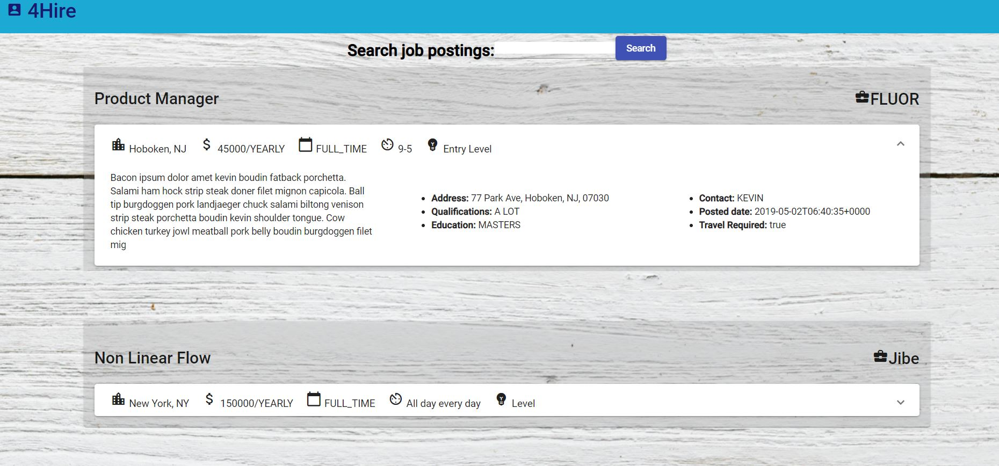

# [iCIMS Job Board Challenge](https://icims-job-challenge.herokuapp.com/) //deployed link
By Alex Lo
___

## Purpose
Retrieve job data from provided API and display to user in a well rounded UI.

## Technologies used and why

**Built with:**
* [Angular](https://angular.io/)
* [Angular Material](https://material.angular.io/)
* [Node](https://nodejs.org/en/)
* [express](https://expressjs.com/)
* [Heroku](https://www.mongodb.com/)

## How to run
Our website features: 

1. GIt clone this repo to your machine
2. 'cd' to root folder
3. Run command "npm install"
4. Run command "npm start"
5. Open localhost:8008 in your browser.
6. Apply for jobs!

## Screenshots

* 

## License
A short snippet describing the license (MIT, Apache etc)

MIT © 
[Alex Lo](https://github.com/alexlo15)

